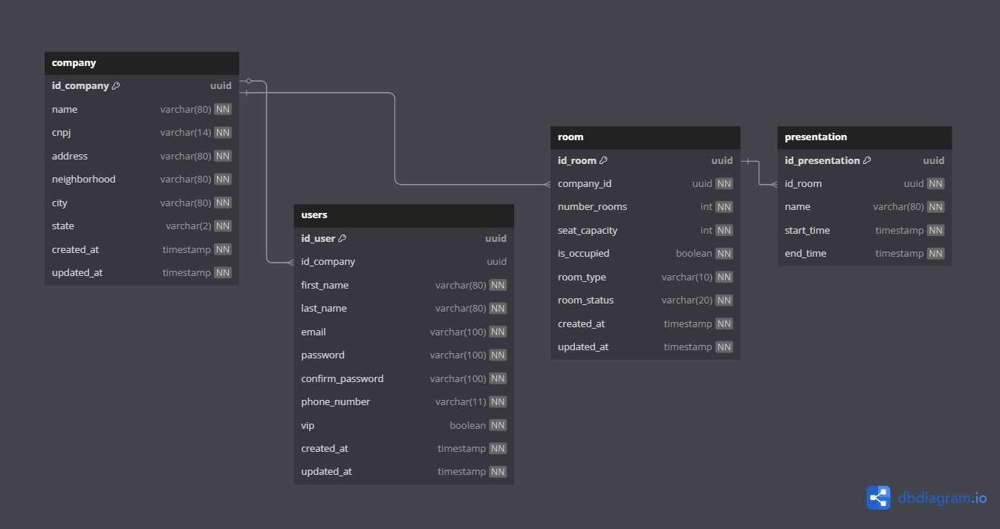

<h1 align="center" style="font-weight: bold;">TechnologyConference 💻</h1>

<div align="center">
  
  
  
  
  
  
</div>

## 🚀 Vamos começar
Vamos começar com a lista de pré-requisito

### 🔧 Pré-requisitos

- [Java SDK 21](https://www.oracle.com/java/technologies/javase/jdk21-archive-downloads.html)
- [Docker Desktop](https://www.docker.com/get-started/)

## ⚙️ Particularidades do sistema

- O sistema possui validação diretamente em lista, então... por algum motivo, o código para de ser executado. Deve reiniciar sua aplicação e executar novamente.
- Sistema de validação totalmente em memória (motivos de estudos).Na classe "Room", não pode existir sala com o mesmo número!! A sala normal tem numeração de 1 à 3, a sala vip tem numeração 4 à 5.
- Na classe "Presentation", não pode existir apresentação no mesmo horário. Cada apresentação tem um intervalo de duas horas.

## 📚 Tabela de Conteúdos

- [Application YML](#application-yml)
- [Docker Compose YML](#docker-compose-yml)
- [Arquitetura](#arquitetura)
- [Spring Security](#spring-security)

### Application YML

Configuração de conexão com o banco de dados:

```yaml
spring:
  application:
    name: TechnologyConference
  datasource:
    url: jdbc:postgresql://localhost:5432/technology_conference
    username: postgres
    password: admin
    driver-class-name: org.postgresql.Driver
  jpa:
    show-sql: true
    hibernate:
      ddl-auto: create-drop
      format_sql: true
  flyway:
    baselineOnMigrate: true
    enabled: true
  locations:
    classpath: db/migration
```

### Docker Compose YML

Criação dos containers Docker:

```yaml
services:
  postgres_db:
    image: postgres:13.20
    container_name: "postgresdb"
    environment:
      POSTGRES_DB: "technology_conference"
      POSTGRES_USER: "postgres"
      POSTGRES_PASSWORD: "admin"
    ports:
      - "5432:5432"
    restart: always
    networks:
      - technology-conference-network

  pgadmin4:
    image: dpage/pgadmin4
    container_name: "pgadmin4"
    environment:
      PGADMIN_DEFAULT_EMAIL: "admin@admin.com"
      PGADMIN_DEFAULT_PASSWORD: "admin"
    ports:
      - "15432:80"
    restart: always
    depends_on:
      - postgres_db
    networks:
      - technology-conference-network

networks:
  technology-conference-network:
    driver: bridge
```

### Arquitetura

Arquitetura do projeto de ser instânciado na memória da seguinte forma:



### Spring Security

A aplicação utiliza o Spring Security com autenticação do tipo Basic Auth.

⚠️ Nota: Essa autenticação é básica e está sendo usada apenas em ambiente de desenvolvimento.

📌 Em breve: será implementado login com Google (OAuth 2.0) usando integração com o Google Cloud Identity, permitindo autenticação segura com contas Google.

### 🖥️ Tela de Login

